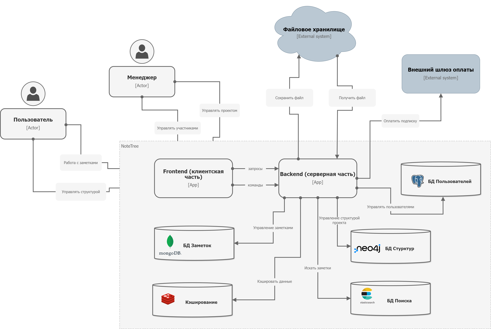
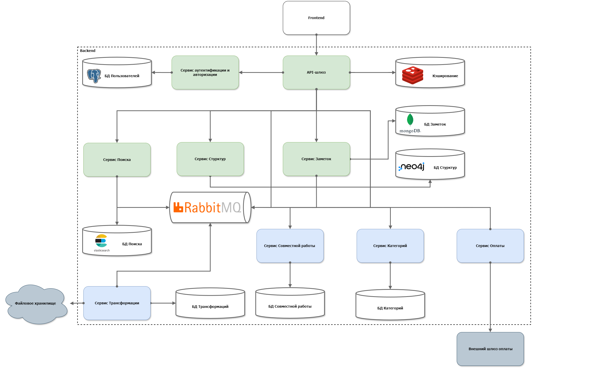

# FastAPI Note Tree

Приложение для систематизации и ведения заметок с иерархической структурой записей

## Стек технологий

- Python
- FastAPI
- MongoDB
- Neo4J
- Redis
- ElasticSearch
- RabbitMQ
- Docker

## Возможности

- [x]   Регистрация и авторизация пользователей
- [x] 	Создание и редактирование заметок
- [x] 	Иерархическая структура заметок
- [x] 	Поиск и фильтрация заметок
- [x] 	Синхронизация данных
- [ ] 	Экспорт и импорт данных
- [ ] 	Поддержка различных устройств и браузеров
- [ ]   Монетизация проекта

## Архитектура

- Диаграмма контейнеров:
    
- Диаграмма компонентов:
    

## Установка

1. Скачайте репозиторий:

   `git clone https://github.com/irumako/fastapi-note-tree.git`
   
2. Запустите сборку Docker контейнера:

   `docker compose up --build`

   
3. Перейдите по адресу http://localhost:8000 в вашем веб-браузере, чтобы получить доступ к приложению.

